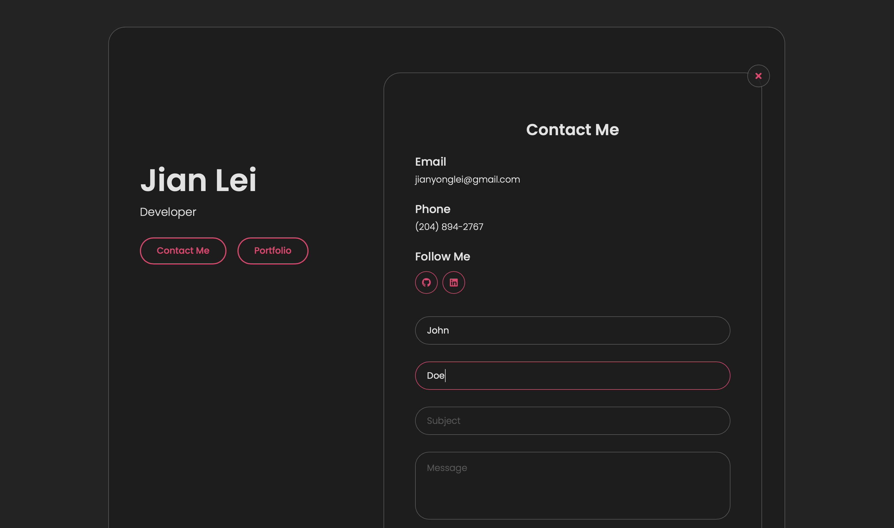

# portfolio
# myLibrary

<a href="https://jianylei.com">Live App</a>

## Table of Contents
- [Introduction](#introduction)
- [Tech](#tech)
- [Screenshots](#screenshots)
## Introduction
Responsive Card style portfolio built to showcase projects.
## Tech
Vanilla Javascript, HTML, CSS

## Screenshots
### Home

    

### Contact

    

### Projects

    

### Project Details

    

### Mobile

    
    
    

    

